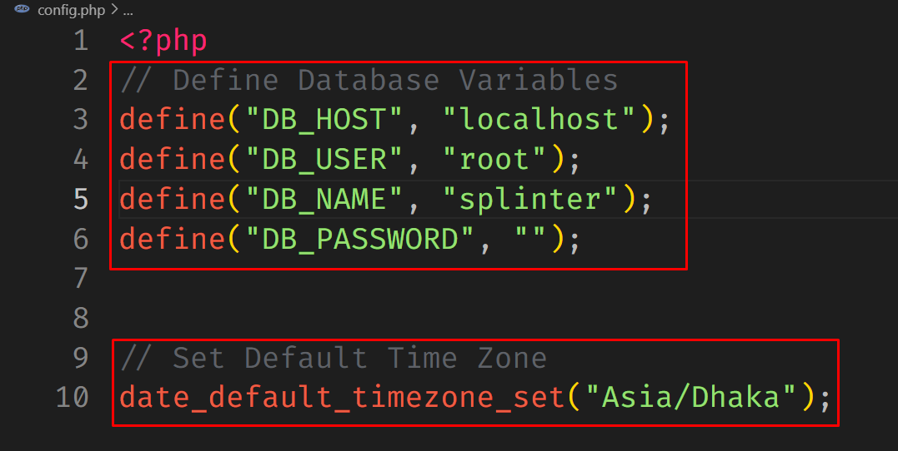

# SPLINTER - To Do List Web App

Splinter is a simple TO DO list web app that helps you to organize your pending tasks easily! Built with Jquery, AJAX, PHP & MySQL

## Configuration

- Step 1: Clone this repository `git clone https://github.com/alnahian2003/splinter.git`

- Step 2: Create a Database with any name in your **MySQL** or **phpMyAdmin** Engine, Import `todo.sql.zip` file in your newly created database.

- Step 3: Update Database Connection variables with your preferred Database information in `config.php` file. Also you should set your Default Timezone for better accessibility.

Please visit [PHP Official Timezone Documentation](https://www.php.net/manual/en/timezones.php) page to get information about your own Timezone ID.
**This isn't required for 🇧🇩 Bangladeshi People! 😊**

### Boom 💥 Now you're good to go!

### If you encounter any problem, please [Contact Me](https://alnahian2003.github.io/#contact)!
